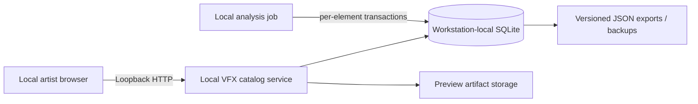

# VFX Element Tagger

Local-first catalog, AI-assisted description, artist review and search for VFX footage
and image sequences. Keep source media on disk, generate browsing proxies, and retain
both model evidence and artist corrections.

**Release status:** v1 release candidate, package version `1.0.0rc1`. This is an
AI-assisted local workstation tool, not certified unattended analysis. Hosted CI and
independent artist evaluation remain required before a stable `v1.0.0` tag.

[Download releases](https://github.com/kkthxs/vfx-element-tagger/releases) or
[browse the source](https://github.com/kkthxs/vfx-element-tagger).

## Start Here

- [Full user guide](docs/USER-GUIDE.md): installation, models, ingest, search, review,
  incremental processing, backups, command reference and troubleshooting.
- [v1 release readiness](docs/RELEASE-READINESS.md): blockers and publication checklist.
- [Security and privacy](SECURITY.md).
- [Contributing and tests](CONTRIBUTING.md).
- [Third-party components and model terms](docs/THIRD-PARTY.md).

## Platform Support

| Workflow | Status |
| --- | --- |
| Full default AI workflow on an Apple Silicon Mac | Tested locally with MLX/Metal and Python 3.12 |
| Catalog, deterministic ingest, review and browser on macOS | Tested locally |
| Catalog/browser on Linux or Windows | Portable design; CI configured, platform validation pending |
| Default AI workflow on Intel Mac, Windows, Linux/CUDA or CPU-only | Not validated/supported by this release |

MLX itself now documents Linux CUDA and CPU backends. That does **not** establish
compatibility of this application's model adapters, snapshots or runtime patches.
See [MLX installation requirements](https://ml-explore.github.io/mlx/build/html/install.html)
and the [full support matrix](docs/USER-GUIDE.md#platform-and-hardware).

## Quick Start: Apple Silicon

Use a source checkout outside cloud-sync folders. From its root, with native ARM64 Python 3.12:

```bash
git clone https://github.com/kkthxs/vfx-element-tagger.git
cd vfx-element-tagger
brew install ffmpeg
python3.12 -m venv .venv
source .venv/bin/activate
python -m pip install --upgrade pip
python -m pip install -r constraints/macos-arm64-py312.lock.txt
python -m pip install -c constraints/macos-arm64-py312.lock.txt -e ".[mlx,hashing]"
cp -n .vfx-tagger.example.json .vfx-tagger.json
python scripts/download_models.py
python scripts/check_models.py
python pilot.py --folder "/absolute/path/to/your/elements" --no-server
python scripts/analyze_gated.py --dry-run --no-challengers --limit 1
python scripts/analyze_gated.py --no-challengers --limit 1
python scripts/serve_library.py
```

Open [the local library](http://127.0.0.1:8765/). Stop the foreground server with Ctrl+C.
For browser-based import, you can start the server after model setup and use **Add elements**
instead of the ingest/analyzer commands above; see the user guide's web workflow.
Replace the source-folder placeholder. Downloading models requires internet access and disk space.
The full runtime lock targets native macOS arm64 / Python 3.12. New AI results require artist
review by default. Model downloads use frozen upstream revisions and verify SHA-256 files.
Do not overwrite an existing `.vfx-tagger.json`; preserve its catalog/cache/model paths.

Ingest alone does not run the VLM. It produces technical metadata, proxies and provisional
fallback tags. Gated analysis is a separate explicit command. Optional challengers can be
downloaded later with `python scripts/download_models.py --with-challengers`.

## Important Limits

- AI descriptions can be confidently wrong. Sparse particles, mixed materials, shot scale,
  depth direction, counts and crops remain difficult. Accepted is a gate status, not ground truth.
- Confidence is uncalibrated model self-report. Action ranges are suggestions, not approved edits.
- Search currently relies on confirmed text/concepts; genuine video embeddings and LanceDB
  integration are not implemented. Missing descriptions can cause search misses.
- The built-in HTTP service is unauthenticated. Keep it on `127.0.0.1`; do not expose it online.
- EXR preview tone mapping and alpha probes are not a certified production color/keying pipeline.
- The legacy `scripts/analyze_with_models.py` is for compatibility/ablation, not the recommended path.

## Implementation Notes

The sections below retain the engineering history of internal 0.5/0.6 iterations.
Those iteration names are not package versions or public release tags. For first-time
setup and supported commands, use the user guide above.

The system treats a logical element as one or more source representations, measures
technical facts deterministically, observes footage across its duration, and retains
compound VFX descriptions instead of forcing every asset into one exclusive label.

### Native Video and Catalog Evolution

- Numeric-only and compound-suffix sequences such as `0001.HR.exr` collapse correctly.
- One `Element` can retain multiple source representations and rich per-representation technical metadata.
- Semantic output is multi-label and temporal: primary/secondary families, subtype, composition, appearance, distinct event count, simultaneous instance count, notable scene objects, depth motion, usability, timestamped evidence, and uncertainty.
- The primary model sees a uniformly sampled native video across the whole duration.
- Low-confidence, incomplete, or activity-contradictory results automatically receive a denser second pass.
- Independent challenger models load only after the uncertainty gate fires.
- Disagreeing candidates are adjudicated and their full provenance is retained for QC.
- Bright border contact is measured across the duration and overrides crop claims for black/alpha plates; vertical luminance bias can resolve top-lit non-emissive volumes.
- Deterministic refinements can be reapplied to a catalog without loading a semantic model.
- Unresolved dust/smoke/debris impacts receive a numbered 16-frame storyboard pass focused on materials, depth, and late falling/settling phases.
- Specialist findings live in `temporal_detail`; depth cannot override an existing in-plane judgment without independent corroboration, and specialist edge claims are always ignored.
- `action_timing` stores visible bounds, main-action bounds, peak, suggested range with handles, activity segments, source, confidence, and verification status from sequential proxy measurements.
- Numbered asset variants are preserved during discovery; low-information black pHashes cannot merge unrelated elements, and filename-only representation links require compatible duration and geometry.
- Exact-fingerprint analysis can be reused across catalogs without rerunning local models.
- Final status is reassessed after deterministic/specialist merges, so resolved measurement conflicts clear while event-count, uncertainty, and loopability contradictions remain review-gated.
- Semantic fields participate in lexical search and can be filtered with dotted keys.
- The old v0.1 fields remain readable while existing catalogs migrate.

SQLite is the recommended operational store; JSON remains supported as a portable evaluation, interchange, and rollback format. LanceDB hybrid retrieval is intentionally a later migration: the analysis vocabulary needs to be validated before the catalog is made more elaborate.

## Pipeline

```mermaid
flowchart LR
    A["Messy nested folders"] --> B["Discover logical movies and sequences"]
    B --> C["ffprobe and OpenImageIO technical truth"]
    C --> D["Display-referred preview movie"]
    D --> E["Cheap full-duration activity profile"]
    E --> F["Primary native-video analysis"]
    F --> G{"Confident and complete?"}
    G -->|yes| H["Accepted structured result"]
    G -->|no| I["Denser primary pass"]
    I --> J["Lazy challenger models"]
    J --> K["Evidence-based adjudication"]
    K --> L["Escalated result or needs review"]
    H --> M["Deterministic field refinement"]
    L --> M
    M --> O{"Impact motion unresolved?"}
    O -->|yes| P["Numbered temporal storyboard"]
    O -->|no| N["QC and semantic search"]
    P --> N
```



Activity measurement drives sampling and gating. Narrow, high-confidence measurements such as actual bright border contact may also refine the final structured fields; broad semantic direction is still left to the video models. The system does not claim that sparse particles, translucent smoke, lightning flicker, or turbulent fire obey rigid optical flow.

## Core ingest

```bash
python3 pilot.py --folder ./elements --no-server
```

Useful options:

```bash
python3 pilot.py --folder ./elements --no-open
python3 pilot.py --folder ./elements --force-recompute
python3 pilot.py --folder ./elements --prune-missing
python3 pilot.py --folder ./elements --no-artifacts
```

Ingest is incremental. Existing elements are reused when their representation paths, file sizes, fingerprints, and perceptual hashes are unchanged. Items outside the current scan remain in the library unless `--prune-missing` is supplied.

The default QC server is `http://127.0.0.1:8765`.

## Artist library browser

The local web interface is organised around the way an artist searches a stock-element
library rather than the order of pipeline stages:

- top-level effect families such as Dust, Smoke, Snow, Fire, Water, and Electricity;
- expandable subtypes such as Ground Dust Hit, Rising Steam Plume, or Branching Lightning Strike;
- poster cards with a muted looping hover preview;
- the full artist description plus composition, motion, appearance, and intended-use tags;
- resolution, frame rate, duration, alpha, source type, bit depth, and colour metadata;
- an optimal-action strip on every analysed card, with visible range and peak detail in the inspector;
- review-status and technical filters, plus semantic search across descriptions, tags, and filenames.
- a per-artist 1–5 star quality rating, Bayesian quality sorting, and rating counts on cards;
- bounded card/video rendering, compact gzip responses, cache validation, and byte-range preview streaming for larger local libraries.

Elements awaiting model analysis receive a conservative provisional family from an obvious
filename cue (for example, `Falling_Snow` appears under Snow) and remain visibly marked
`Not analysed`. Model-backed primary families always take precedence. Pipeline re-run and
challenger-comparison controls remain available under **Pipeline & model controls** in the
element inspector.

## Local catalog layout

Use one SQLite catalog on the workstation's **local disk**. The browser connects through
the local HTTP service, and analysis jobs run on the same workstation. v1 does not support
remote clients or distributed workers. Do not put the live `.sqlite3`,
`-wal`, or `-shm` files on Dropbox, SMB, NFS, or another network mount: SQLite protects concurrent
threads and processes on one host, but its database file is not a network protocol.



Migrate an existing portable catalog without changing any element payloads:

```bash
python3 scripts/migrate_catalog.py \
  --source .cache/vfx-element-tagger-expanded/library.json \
  --target "$HOME/Library/Application Support/VFX Element Tagger/library.sqlite3"
```

Run ingest or the browser against that catalog by passing the same `--library` path.
v1 only supports loopback serving on one workstation; LAN and public hosting are unsupported
and non-loopback binds are refused. Browser rating identities are not authentication.
Use **Add elements**, **Process pending** and confirmed **Force reprocess** for browser
jobs with progress, cancellation, automatic backups and serialized catalog writes.
Folder import references local footage without uploading/copying it. Start the server
from the AI environment for model-backed jobs. Stop the server and other writers before
separate merge/migration/maintenance tools; the current ingest/analyzer CLI also uses
the cooperative writer lease. See [the web workflow](docs/USER-GUIDE.md#through-the-web-interface).

The operational schema stores full element payloads plus indexed family, subtype, status, technical
fields, processing history, and one rating per `(element, artist)`. Re-rating updates the existing
row. Quality order uses a five-vote prior centred on 3/5, preventing one early five-star vote from
dominating established assets. Ratings only break ties among semantically relevant search results;
they cannot make an unrelated element pass the relevance gate.

Analysis and review jobs write one element per transaction, so a completed result does not require
rewriting the whole catalog. Run one discovery/merge coordinator at a time; multiple model workers
may safely commit distinct elements, while browser ratings remain independently transactional. A
single application server is the intended shape for thousands to tens of thousands of elements. Move
the same API contract to PostgreSQL when the deployment needs multiple active API replicas, central
login/permissions, or writes in several sites during a server outage.

### Human review queue

Open `http://127.0.0.1:8765/review`, or use the amber **Review** badge in the library header,
to work through analysed elements whose status is `needs_review`. The page shows the playable
element, the remaining gate failures and model uncertainty in plain language, and only the
fields that need useful artist judgment. Each field offers the selected analysis, distinct
primary/challenger proposals, and a custom input. Confirming the form:

- stores field-level values, previous values, timestamp, and an optional reviewer note;
- updates the semantic result and compatibility/search fields immediately;
- changes the item to `accepted` and removes it from the review queue;
- records the decision in `human_overrides` and `analysis_escalation.human_review_history`;
- reapplies confirmed human fields after later gated-analysis and deterministic-refinement runs.

The original candidates and uncertainty are retained as provenance; accepting an item does
not rewrite history or manufacture a higher model-confidence score.

## Local model setup

Install Apple Silicon analysis support:

```bash
python -m pip install -r constraints/macos-arm64-py312.lock.txt
python -m pip install -c constraints/macos-arm64-py312.lock.txt -e ".[mlx,hashing]"
python3 scripts/download_models.py
```

Models default to `~/.cache/vfx-element-tagger/models`, outside Dropbox and the repository. This avoids repeatedly syncing tens of gigabytes and sharply reduces cold-load latency.

That is the fallback for unconfigured installations; `.vfx-tagger.example.json` instead uses
a sibling model directory. The optional embedding model is not integrated into catalog search.

The default download is the primary analyzer:

- `mlx-community/Qwen3.5-4B-MLX-4bit` — compact native image/video instruction model.

Download the primary plus both optional challengers with:

```bash
python3 scripts/download_models.py --with-challengers
```

The challenger slots are:

- `mlx-community/MiniCPM-o-4_5-4bit` — independent ordered multi-frame view.
- `NemoStation/Marlin-2B-MLX-8bit` — dense event captioning/temporal grounding. Its pure-MLX narrative is retained as ordered challenger evidence and passed to the structured adjudicator, but exact timestamps are not treated as authoritative.

The legacy embedding slot is not integrated into catalog search and is not part of the
frozen v1 stack. The downloader refuses that unfrozen slot; do not download it for v1.

The model choices are configuration, not hard-coded logic. A manifest entry can use `backend: mlx_video`, or a local model wrapper can use the `command` backend. Command wrappers receive the prompt on stdin and the video path as their final argument, which keeps additional challengers local and lazy.

## Limited gated analysis

The analyzer defaults to only five elements and chooses a deterministic diverse slice across source kind, duration, alpha, format, resolution, and fallback family:

```bash
python3 scripts/analyze_gated.py --limit 5
```

Useful controls:

```bash
python3 scripts/analyze_gated.py --limit 2
python3 scripts/analyze_gated.py --element-id element_abc123 --limit 1
python3 scripts/analyze_gated.py --no-challengers --limit 3
python3 scripts/analyze_gated.py --selection sequential --limit 3
python3 scripts/analyze_gated.py --confidence-threshold 0.92 --limit 3
python3 scripts/analyze_gated.py --force --limit 1
python3 scripts/analyze_gated.py --dry-run --limit 1
```

Sampling budgets cover the full duration rather than fixed first/middle/last posters:

| Duration | Primary pass | Dense uncertainty pass | Ultra low-confidence pass |
|---|---:|---:|---:|
| up to 5 s | 8 fps, cap 48 | up to 12 fps, cap 96 | up to 24 fps, cap 144 |
| 5–15 s | 4 fps, cap 64 | 8 fps, cap 128 | 16 fps, cap 192 |
| over 15 s | 2 fps, cap 96 | 4 fps, cap 160 | 8 fps, cap 240 |

Before those semantic passes, a cheap sequential profiler measures every frame of the 480p proxy
(with a bounded stride only beyond 30,000 frames). It downsizes each frame to 192 pixels on its
long edge and retains only scalar change, occupancy, edge and key-screen signals. This supplies
action windows and source-frame/seconds ranges without letting motion magnitude determine the
element's semantic label. Uniform full-duration anchors are always retained alongside activity
peaks.

Foreground-relative change is also measured at the profiler input resolution, so sparse moving
particles are not averaged away. Colour occupancy alone cannot force a production-plate family.
Configured sampling caps are upper bounds; actual frame count, resolution, source indices and
timestamp groups are recorded in each candidate's `input_diagnostics`.

The gate escalates for parse failure, low overall confidence, incomplete fields, unknown core
motion/family judgments, a narrow action window that deserves denser confirmation, or a
contradiction between measured temporal change and a claim such as `speed: still`. A severely weak
dense result can use the ultra tier before challengers. Challenger models are never loaded for a
confident resolved pass.

The normal semantic model reads the 1080p proxy. If the lightweight profile finds sparse structure
near the proxy's information floor—or the semantic result identifies a delicate particle family—a
separate detail specialist receives a 16-panel, activity-focused storyboard from the original movie
when available (1080p fallback for image sequences). Its conservative merge can add secondary
materials, texture, density and fine-detail motion, but cannot replace a well-supported broad family.
When proxy information is explicitly limited, high-confidence source frames may expand a measured
action tail that the proxy lost; they never shorten the proxy range or displace its measured peak.

Each saved result includes:

- `semantic_analysis` — the selected structured result.
- `analysis_candidates` — every primary, dense, challenger, and adjudicator attempt.
- `analysis_escalation` — trigger reasons, sampling plans, disagreement, and selected model/role.
- `analysis_escalation.activity_profile` — every-frame/strided coverage, proxy-detail risk, focus timestamps, and action evidence.
- `analysis_escalation.high_resolution_detail_specialist` — why the source-resolution pass ran, exact storyboard dimensions/timestamps, raw result, and accepted refinements.
- `temporal_detail` — accepted phase/material evidence from the storyboard specialist; unaccepted raw depth evidence remains in `analysis_escalation.temporal_specialist` for QC only.
- `action_timing` — measured `visible`, `main_action`, `peak`, and `optimal` ranges plus event segments and pattern (`burst`, `sustained`, `continuous`, or `multiple_events`).
- `analysis_status` — `accepted`, `escalated`, `needs_review`, or `failed`.
- `human_overrides` — reserved for durable artist corrections that model refreshes must not erase.

When only deterministic rules have changed, reuse the stored semantic work instead of loading the models again:

```bash
python3 scripts/refine_catalog.py \
  --library .cache/vfx-element-tagger/library.json \
  --limit 100
```

Use repeated `--element-id` arguments to constrain the pass. The activity profile and every applied field refinement are recorded in `analysis_escalation`.

Reuse validated analysis for byte-identical media discovered in another catalog:

```bash
python3 scripts/reuse_analysis.py \
  --source-library .cache/vfx-element-tagger-testing/library.json \
  --target-library .cache/vfx-element-tagger-expanded/library.json
```

Merge a separately tested catalog into the main library, including relocated posters and previews:

```bash
python3 scripts/merge_catalogs.py \
  --target .cache/vfx-element-tagger-expanded/library.json \
  --source .cache/vfx-element-tagger-gs/library.json
```

The merge deduplicates by element ID and content fingerprint, preserves existing target records and
artist overrides, and writes a timestamped catalog backup before saving.

Audit every stored action range for ordering and duration bounds:

```bash
python3 scripts/audit_action_timing.py \
  --library .cache/vfx-element-tagger-expanded/library.json
```

## Technical truth

`ffprobe` supplies movie/container metadata. When OpenImageIO is installed, image sources also retain channel names and formats, alpha/Z channels, deep status, data/display windows, tiling, and scalar source attributes. Resolution, FPS, alpha, bit depth, colour information, and sequence gaps are not delegated to a vision-language model.

For best EXR preview conversion, install OpenImageIO so `oiiotool` is available:

```bash
brew install openimageio
```

## Search

Semantic search canonicalises artist phrasing (for example `chroma key` → `greenscreen`, `overhead`
→ `top_down`, and `actor` → `person`) and ranks matches by weighted family, subtype, description,
composition, motion, appearance, facets, filename, and usability fields. A result must satisfy enough
query concepts—and every explicit family/material concept—to be admitted. This prevents deterministic
fallback vectors from filling the result tail with unrelated elements. Genuine model-backed vectors,
when present, supplement rather than bypass this relevance gate. Structured filters include:

- `category` or `primary_family`
- `secondary_family`
- dotted semantic paths such as `semantic.motion.speed`, `semantic.composition.viewpoint`, or `semantic.appearance.backing`

This makes artist queries such as “fast smoke cutting the right edge”, “wide top-down explosion”, or “branching blue lightning one-shot” searchable before the future video-embedding/LanceDB layer lands.

The current ranker is concept coverage with a vector tie-break, not pure RRF. RRF contributions
remain diagnostic only. Uncertain alternatives, search suggestions, negated claims and stale
compatibility facets cannot establish visual matches. Filenames cannot establish a family for
analysed elements. Missing descriptions therefore correctly remain retrieval misses rather than
being concealed by a useful filename. The present catalog uses no genuine semantic embeddings.

## Verification

See `evaluation/FIXES-AND-RETEST-2026-10-07.md` for the relocation checks, implemented safeguards,
six-clip real-model retest and unresolved failures. `evaluation/BENCHMARK-PROTOCOL.md` describes
the separate artist-labeled evaluation still required before claiming production accuracy.

```bash
PYTHONPYCACHEPREFIX=/tmp/vfx-tagger-pycache python3 -m unittest discover -s tests
```

The older `scripts/analyze_with_models.py` remains for catalog compatibility and ablation testing. It is not the recommended analysis path: its single category gate, fixed still-frame captioning, optical-flow prompt bias, and large text-only embedding stack are the limitations v0.5 is designed to remove.

For a partial artist-ground-truth score after a test run:

```bash
python3 scripts/evaluate_ground_truth.py \
  --library .cache/vfx-element-tagger-testing/library.json \
  --ground-truth evaluation/testing_ground_truth.json
```

Only the artist-specified facts are scored; extra correct detail is not penalised.

## License

Application source is [MIT licensed](LICENSE). Model weights and external programs retain
their own terms. No model weights, production footage or private catalogs are distributed
with the source repository.
